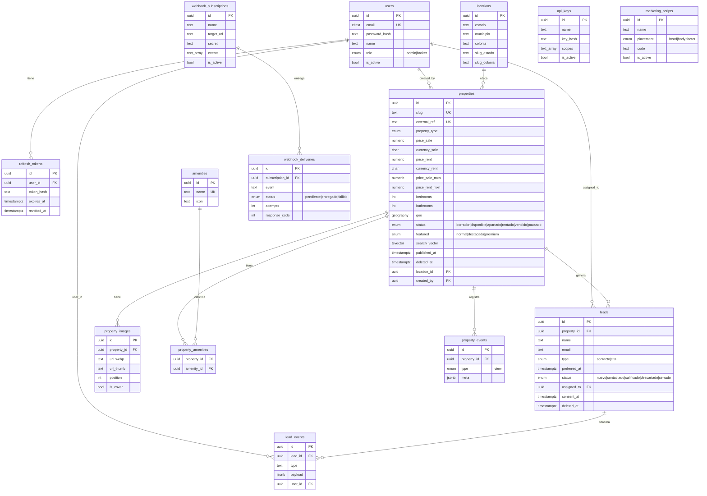

# ERD — Modelo de datos (borrador) · Plataforma TAR Internacional

> Borrador de la Fase 1 (PRD §4.1). Fuente de verdad: `packages/db/src/schema.ts`.
> El **ERD definitivo en PDF** (entregable §15) se genera en el Lanzamiento.
> Dump del esquema aplicado: [`docs/schema.sql`](./schema.sql).

Diagrama (Mermaid) de las 14 tablas del dominio. PostgreSQL 16 + PostGIS 3.4
(`geo` en `geography(Point,4326)`; full-text español en `properties.search_vector`).

## Notas de diseño
- **Precios duales:** una propiedad puede ofrecerse en venta, renta o ambas. El
  display usa la moneda original; los filtros/orden usan `price_*_mxn` (normalizado
  con `USD_MXN_RATE`).
- **Soft delete:** `properties.deleted_at` y `leads.deleted_at` (nunca hard delete).
- **Índices:** btree compuestos para filtros escalares, GIN full-text sobre
  `search_vector`, GiST sobre `geo`, únicos sobre `slug` y `external_ref`.
- `api_keys` y `marketing_scripts` no tienen FKs (catálogos independientes).
